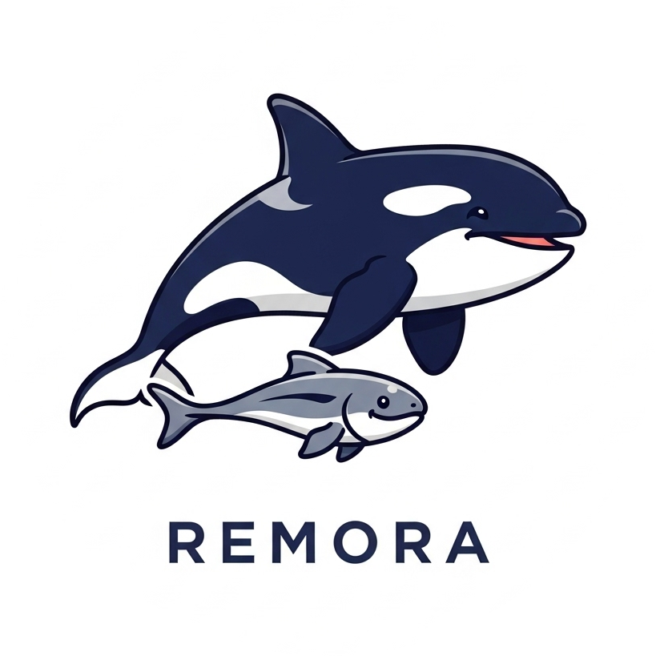

# Remora 

  

Remora swims alongside the Orca screen reader and uses IPC to:
- Provide OCR
- Interact with Ollama Vision Models
- Provide quick hotkeys for common settings

## Installation

- Download [the latest release](https://github.com/C-Loftus/Remora/releases/latest) from Github or [build from source](#building) 
- To install Remora as a desktop application, you can run `make install` in the makefile.

## Limitations: 

- You must use a recent version of Orca (at least v49.0 beta or above)
- This app only works on X11; Wayland does not support global hotkeys or coordinates and thus is impossible to support across compositors
- To use hotkeys you cannot have numlock or another modifier key enabled
- Currently supports only amd64
- You must tab into the GUI window to read its contents with Orca due to [a bug in webkit gtk](https://gitlab.gnome.org/GNOME/orca/-/issues/493)

## Building

You must have [wails](https://wails.io/docs/gettingstarted/installation) installed to build this program. Then follow the commands in the [makefile](./makefile)

## Screenshot

